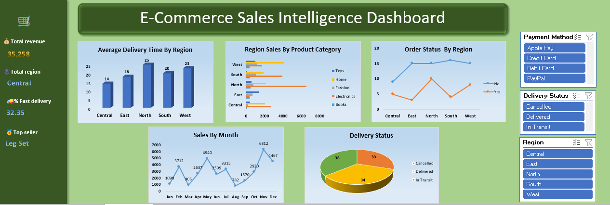

# 🛒 E-Commerce Sales Dashboard

## 📌 Project Overview
An Excel-based sales analysis dashboard built on 100 orders across
5 regions and 5 product categories.

## 📊 Key Features
- Pivot Tables for regional & category sales breakdown
- Delivery status tracking (Delivered/In Transit/Cancelled)
- Average delivery time analysis by region
- Discount usage & payment method analysis
- Sales vs. Target comparison by region

## 🛠 Tools Used
- Microsoft Excel
- Pivot Tables & Charts
- Data Cleaning & Formatting

## 📸 Dashboard Preview

## 🔍 Key Insight
North region led with highest sales of ₹10,491, driven by Electronics.
